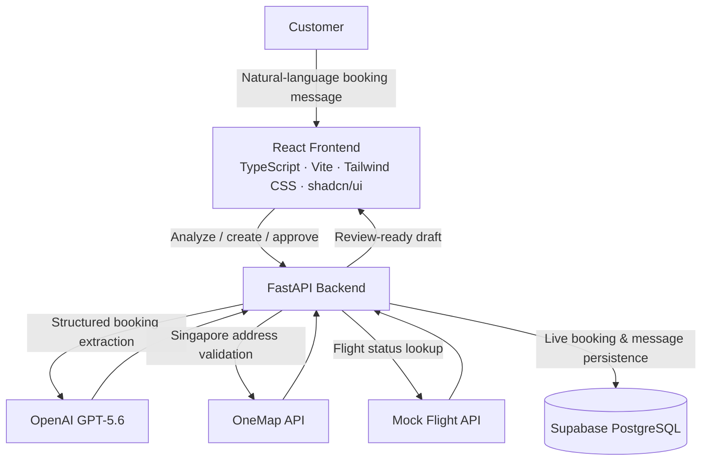
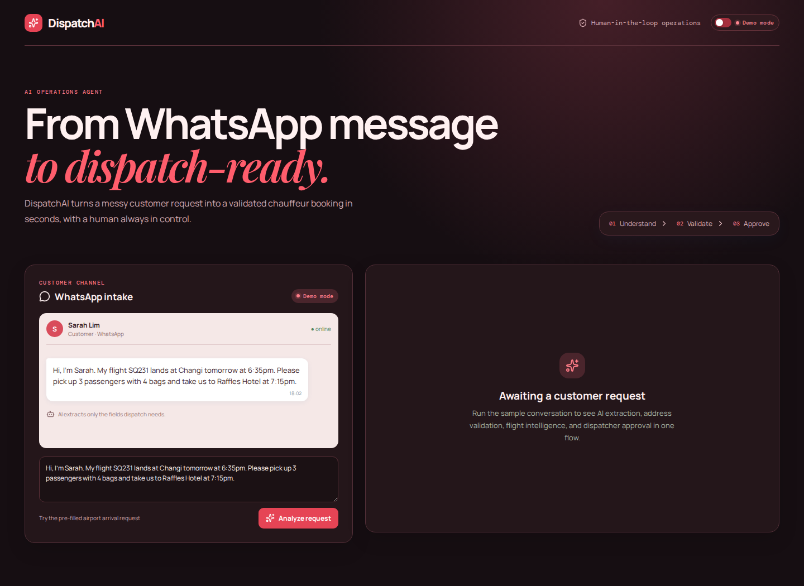
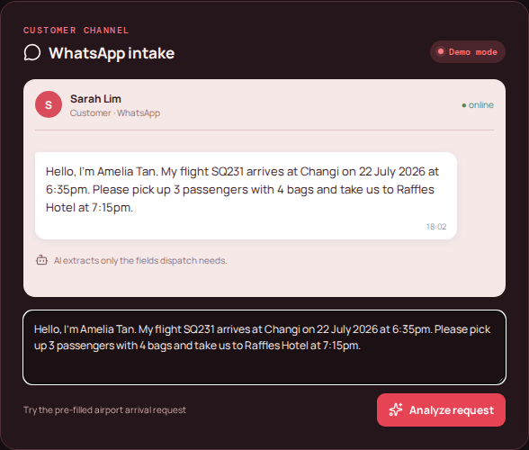
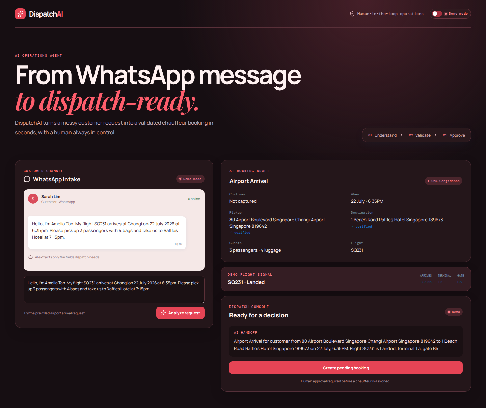
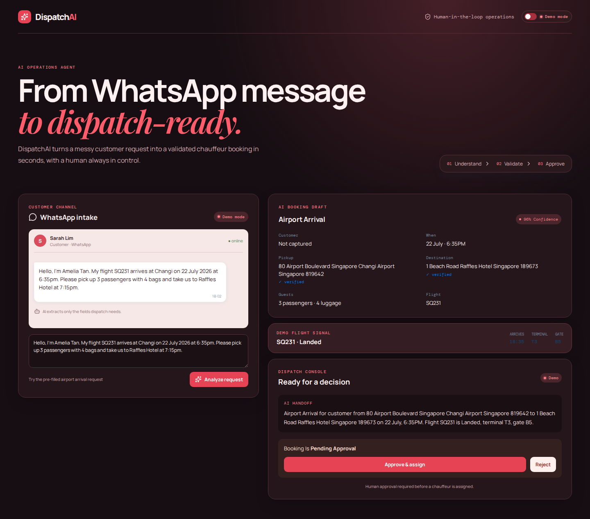
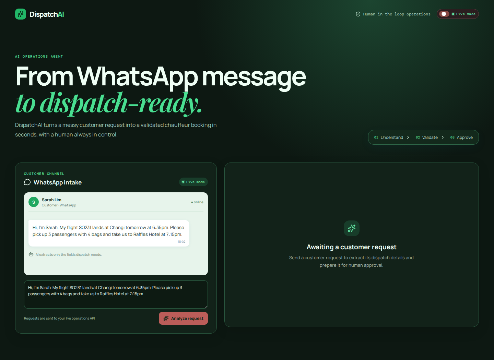
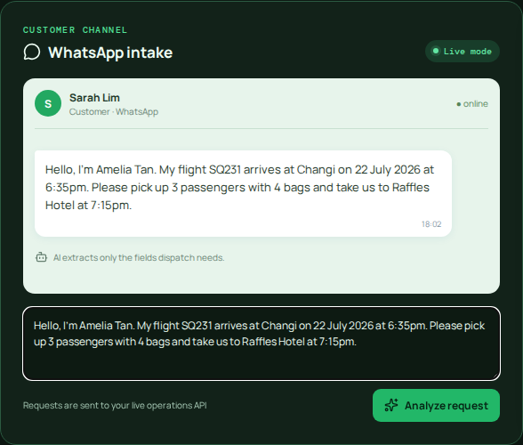
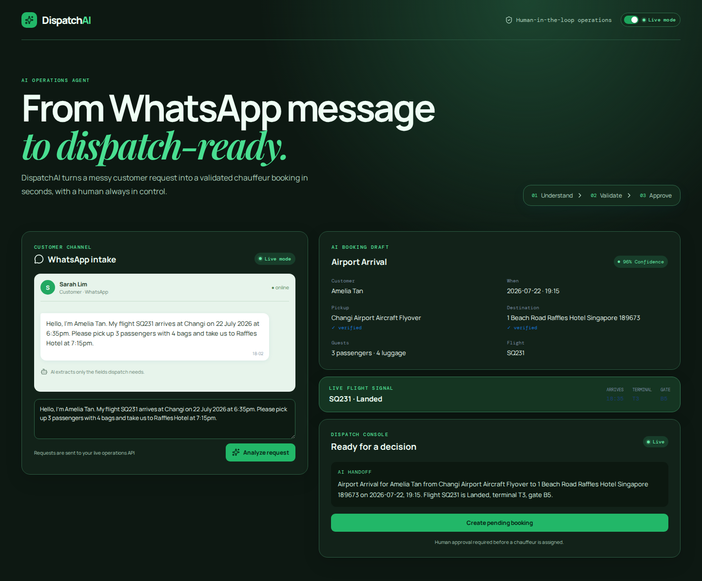
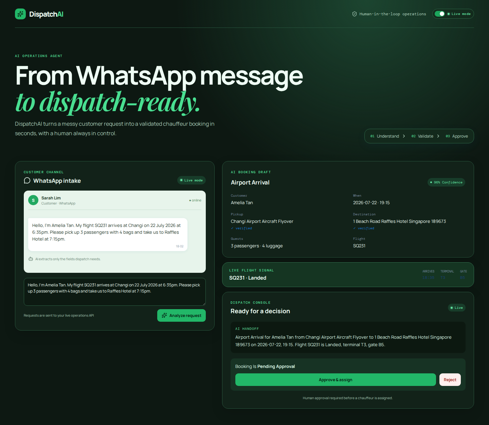

# DispatchAI

> **An AI Operations Agent that turns natural-language customer messages into validated, human-approved chauffeur booking drafts.**

Built for **OpenAI Build Week** · **Work & Productivity** track

## Overview

DispatchAI helps chauffeur-dispatch teams turn conversational customer requests into a structured operational handoff. A dispatcher can paste a WhatsApp-style message, review the AI's extracted booking details and validation results, create a booking draft, and approve or reject it—all without losing human oversight.

The project supports two operating modes:

| Mode | Purpose | Behavior |
| --- | --- | --- |
| **Demo** | Reliable hackathon demonstration | Uses deterministic server-side extraction, address fixtures, mock flight data, and in-memory bookings. |
| **Live** | Production integration path | Uses OpenAI for field extraction, OneMap when configured for address validation, and Supabase for booking persistence when configured. |

## Problem

Chauffeur booking requests often arrive as unstructured messages: flight numbers, pickup times, passenger counts, luggage, and destinations are mixed into informal language. Dispatchers must manually interpret the message, verify addresses and flight details, re-enter the data into operations tools, and decide whether the request needs a follow-up.

That manual workflow is repetitive, slow during busy periods, and vulnerable to missed or ambiguous details. It also forces dispatchers to spend attention on transcription rather than exception handling and customer service.

## Solution

DispatchAI converts the first pass of dispatch work into a reviewable workflow. It extracts the booking fields that matter, validates operational facts through the appropriate integrations, flags missing details or risks, and presents a concise dispatcher summary. The final decision remains with a human dispatcher.

## Features

Implemented in this repository:

- WhatsApp-style customer intake with an editable customer message.
- AI-assisted extraction of customer name, booking type, date, pickup time, pickup, destination, flight number, passenger count, and luggage.
- OpenAI-powered extraction in Live mode, using the configured `OPENAI_MODEL` (default: `gpt-5.6`).
- Deterministic, offline-friendly extraction for Demo mode.
- Singapore address validation through OneMap when an access token is configured, with a deterministic demo fallback.
- Mock flight lookup for supported flight numbers, returning status, arrival time, terminal, and gate.
- Dispatcher-facing booking details, confidence, warnings, follow-up prompt, and operational summary.
- Creation of bookings in a `pending_approval` state.
- Human approval or rejection of booking drafts.
- Booking message history for customer, agent, and dispatcher events.
- Supabase-backed booking and message persistence in Live mode when Supabase credentials are configured.
- Health endpoint and a small REST API for analysis, bookings, flight lookup, and messages.

## Architecture Diagram



## AI Workflow

DispatchAI deliberately separates language reasoning from operational truth.

| Component | Responsibility |
| --- | --- |
| **GPT-5.6 (LLM)** | Interprets the customer's language and extracts a structured booking draft. It is instructed to leave unknown fields as `null` and not invent addresses, dates, flight status, terminals, or gates. |
| **FastAPI** | Orchestrates the workflow: selects Demo or Live mode, calls the extractor, validates addresses, looks up flights, calculates the review result, and exposes booking and approval APIs. |
| **OneMap** | Validates and normalizes Singapore addresses in Live mode when `ONEMAP_ACCESS_TOKEN` is present. |
| **Mock Flight API** | Returns the authoritative demo flight record for supported flight numbers, including status, terminal, gate, and arrival time. |
| **Supabase** | Persists Live-mode booking drafts and their associated customer, agent, and dispatcher messages. |

> **The LLM performs reasoning and information extraction while external APIs remain the source of truth.**

Typical flow: a customer message is analyzed into a booking draft; FastAPI validates its pickup and destination, retrieves available flight information, identifies missing details or warnings, and returns a dispatcher-ready review. Only after the dispatcher creates and approves the draft is the booking decision finalized.

## Screenshots

The following captures use the same realistic airport-arrival request in a 1440 × 1050 browser viewport. The extraction views show verified Singapore address results; Demo Mode uses its deterministic workflow, while Live Mode uses the configured OpenAI, OneMap, and Supabase integrations.

## Demo Video

<video src="docs/demo/dispatchai-demo.mp4" poster="docs/screenshots/demo/01-home.png" width="960" controls>
  Your browser does not support embedded video. Download or open the demo using the link below.
</video>

[Watch the 2 minute 55 second DispatchAI demo video](docs/demo/dispatchai-demo.mp4)

The video is exported as a 1920 × 1080 MP4 and includes concise on-screen captions for the Demo Mode and Live Mode workflows.

## Demo Mode

### Home



### WhatsApp intake



### AI booking extraction and address validation



### Booking saved for dispatcher approval



## Live Mode

### Home



### WhatsApp intake



### AI booking extraction and OneMap address validation



### Booking saved for dispatcher approval



## Tech Stack

| Layer | Technologies |
| --- | --- |
| Frontend | React, TypeScript, Vite, Tailwind CSS, shadcn/ui |
| Backend | FastAPI (Python) |
| Database | Supabase PostgreSQL |
| AI | OpenAI GPT-5.6 |
| External services | OneMap API, Mock Flight API |

## Installation

### Prerequisites

- Node.js 18+ and npm
- Python 3.10+
- An OpenAI API key only for Live mode

### Frontend

```bash
npm install
```

### Backend

```bash
python3 -m venv .venv
source .venv/bin/activate
pip install -r backend/requirements.txt
```

On Windows PowerShell, activate the environment with:

```powershell
.\.venv\Scripts\Activate.ps1
```

### Environment variables

Copy the example file, then add the credentials required for the mode you plan to use:

```bash
cp .env.example .env
```

```dotenv
# Optional when the frontend and API run on different origins
VITE_API_URL=

# Required for Live extraction
OPENAI_API_KEY=
OPENAI_MODEL=gpt-5.6

# Required for Live OneMap address validation
ONEMAP_ACCESS_TOKEN=

# Required for Live Supabase persistence
SUPABASE_URL=
SUPABASE_KEY=
```

### Run locally

Start the FastAPI server from the repository root:

```bash
uvicorn app.main:app --reload --app-dir backend
```

In a second terminal, start the frontend:

```bash
npm run dev
```

Open [http://localhost:5173](http://localhost:5173). Confirm that the API is available at [http://localhost:8000/api/health](http://localhost:8000/api/health); it should return the supported `demo` and `live` modes.

For Supabase persistence, apply [`supabase/schema.sql`](supabase/schema.sql) to a new project. Existing projects that predate the `flight` field also need [`supabase/migrations/20260714_add_booking_flight.sql`](supabase/migrations/20260714_add_booking_flight.sql).

## Production Integration Notes

| Variable | Used for | Notes |
| --- | --- | --- |
| `OPENAI_API_KEY` | Live LLM extraction | Keep server-side only. Live analysis returns a configuration error if it is absent. |
| `OPENAI_MODEL` | Selects the OpenAI model | Defaults to `gpt-5.6`. |
| `ONEMAP_ACCESS_TOKEN` | Live Singapore address validation | Keep server-side only; OneMap Search API tokens expire and must be refreshed. |
| `SUPABASE_URL` | Supabase project connection | Required with `SUPABASE_KEY` to enable persistence. |
| `SUPABASE_KEY` | Supabase server access | Use a restricted server-side key in production; never expose it to the browser. |

**Demo mode** is designed for a dependable walkthrough. It uses FastAPI, deterministic extraction and validation fixtures, the mock flight service, and an in-memory booking store. It does not require OpenAI, OneMap, or Supabase credentials.

**Live mode** sends extraction to OpenAI. If configured, OneMap validates addresses and Supabase stores bookings and messages. The backend retains ownership of all secrets and integration calls; the frontend communicates only with the FastAPI API.

## Devpost Submission

### What it does

DispatchAI is an AI Operations Agent for chauffeur dispatch teams. It transforms a natural-language customer message into a structured booking draft, validates addresses, retrieves flight information, flags missing details, and prepares a clear dispatcher handoff. A human dispatcher then creates the draft and approves or rejects it, keeping the final operational decision in human hands.

### Inspiration

Travel and chauffeur operations are full of valuable but messy customer messages. A single WhatsApp request can contain a flight, arrival time, passenger count, luggage, and hotel destination—yet someone still has to read, verify, and retype it before the ride can be arranged. We wanted to show how an AI agent can remove that repetitive first pass while preserving the judgment that matters most in real operations.

### How we built it

We built a React, TypeScript, and Vite frontend around a WhatsApp-style intake and dispatcher review experience. A FastAPI backend orchestrates the workflow. In Live mode, OpenAI GPT-5.6 extracts a structured booking draft from the customer message. FastAPI then validates Singapore addresses with OneMap when configured, retrieves flight details through a mock flight service, prepares warnings and a dispatcher summary, and persists Live-mode bookings and messages to Supabase. Demo mode uses deterministic server-side fixtures so the end-to-end flow remains reliable for a hackathon presentation.

### Challenges we ran into

The hardest design challenge was deciding what the model should do—and what it should not do. Booking messages are ambiguous, but operational facts such as an address, flight status, terminal, and gate must be verified rather than guessed. We also needed a demo that was dependable without pretending it was a full production integration, which led to an explicit Demo/Live mode split.

### Accomplishments that we're proud of

We created a complete path from informal message to human-approved booking draft, rather than stopping at a chat response. We are especially proud of the separation between LLM extraction and external validation, the clear dispatcher-facing warnings and follow-up prompts, and the ability to run a deterministic demo while retaining a practical path to OpenAI, OneMap, and Supabase integrations.

### What we learned

We learned that useful operations agents need more than extraction quality: they need explicit boundaries, auditable handoffs, and graceful handling of missing information. The LLM is effective at understanding language, while external systems should retain ownership of factual data. Human review is not an afterthought—it is a core product capability for high-consequence workflow decisions.

### What's next

Next, we want to connect DispatchAI to real messaging and flight providers, expand address and service-area validation, and deepen the dispatcher workflow with assignment and operational monitoring. We would also evaluate the extraction and validation pipeline against real, anonymized booking requests before using it in production.

## Future Improvements

The following are planned enhancements, not features currently implemented:

- Integrate a real messaging channel such as WhatsApp Business for inbound and outbound communication.
- Replace the mock flight service with a live flight-data provider and support proactive disruption alerts.
- Add vehicle, driver, availability, and route-assignment workflows.
- Add role-based access control, audit logs, and production-grade observability.
- Add automated follow-up messages for missing booking details, subject to dispatcher controls.
- Add evaluation datasets, extraction quality metrics, and feedback loops from dispatcher corrections.
- Support multilingual messages and configurable service areas beyond Singapore.

## Built with Codex & GPT-5.6

### GPT-5.6

In Live Mode, DispatchAI uses GPT-5.6 as its language-understanding and reasoning engine. It interprets natural-language customer booking messages and extracts the structured booking information that the workflow needs, including customer details, booking type, pickup, destination, flight number, timing, passengers, and luggage. That structured result enables DispatchAI to identify missing booking details, prepare a dispatcher summary, and support the Live Mode booking workflow.

GPT-5.6 is deliberately limited to language understanding and reasoning. It must not invent addresses, flight information, terminals, gates, or other operational facts. DispatchAI verifies those facts through external services: OneMap validates Singapore addresses, the flight service supplies flight details, and Supabase persists Live Mode bookings when configured. Demo Mode uses a deterministic extraction and validation path for reliable offline-friendly demonstrations.

### Codex

Codex accelerated development across the project by assisting with React frontend components, FastAPI backend endpoints, and the integrations for GPT-5.6, OneMap, and Supabase. It also supported refactoring and debugging, architectural improvements, documentation and README generation, project screenshots, and preparation of the demo assets and overall hackathon submission.

All generated code and supporting materials were reviewed, tested, integrated, and adapted by the project author before inclusion in DispatchAI.

## License

This project is licensed under the [MIT License](LICENSE). See [LICENSE](LICENSE) for the full terms.
